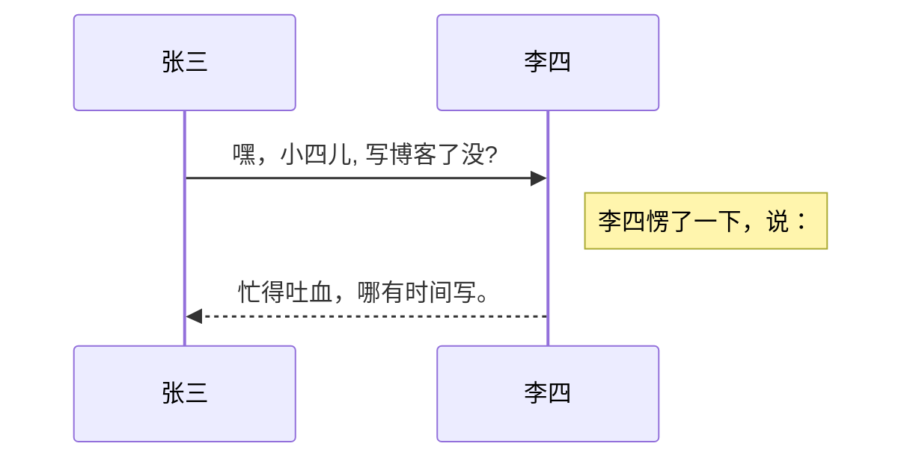

## Markdown及扩展

本编辑器支持 **Markdown Extra** , 　扩展了很多好用的功能。具体请参考[Github][2].  

### 表格

**Markdown　Extra**　表格语法：


| 项目      |    价格 | 数量  |
| :-------- | --------:| :--: |
| Computer  | 1600 元 |  5   |
| Phone     |   12 元 |  12  |
| Pipe      |    1 元 | 234  |

### 定义列表

**Markdown　Extra**　定义列表语法：
项目１
项目２
:   定义 A
:   定义 B

项目３
:   定义 C

:   定义 D

	> 定义D内容


### 脚注
生成一个脚注[^footnote].
  [^footnote]: 这里是 **脚注** 的 *内容*.
  
### 目录
用 `[TOC]`来生成目录：

@[toc]


<br><br><br><br>


<br><br><br><br>

### UML 图:

可以渲染序列图：



或者流程图：

```mermaid
flowchat
st=>start: 开始
e=>end: 结束
op=>operation: 我的操作
cond=>condition: 确认？

st->op->cond
cond(yes)->e
cond(no)->op
```

- 关于 **序列图** 语法，参考 [这儿][4],
- 关于 **流程图** 语法，参考 [这儿][5].


---------

[2]: https://github.com/jmcmanus/pagedown-extra "Pagedown Extra"
[4]: http://bramp.github.io/js-sequence-diagrams/
[5]: http://adrai.github.io/flowchart.js/
[6]: https://github.com/benweet/stackedit